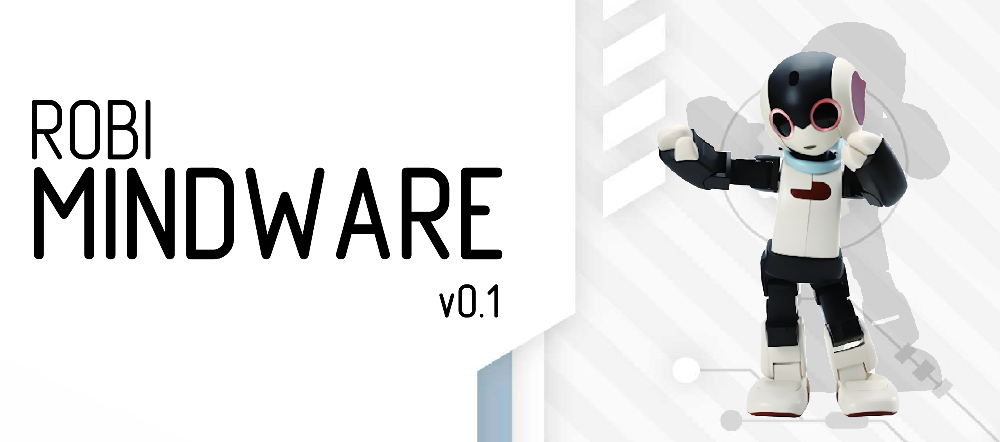
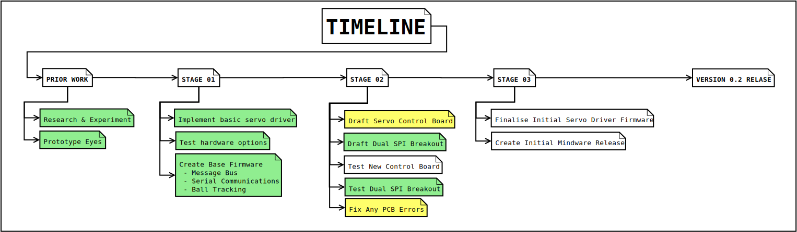
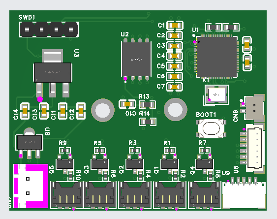
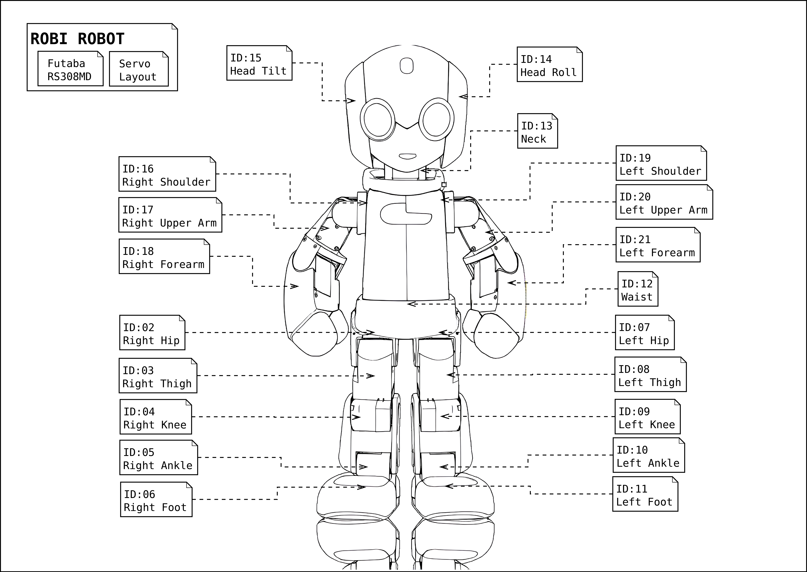
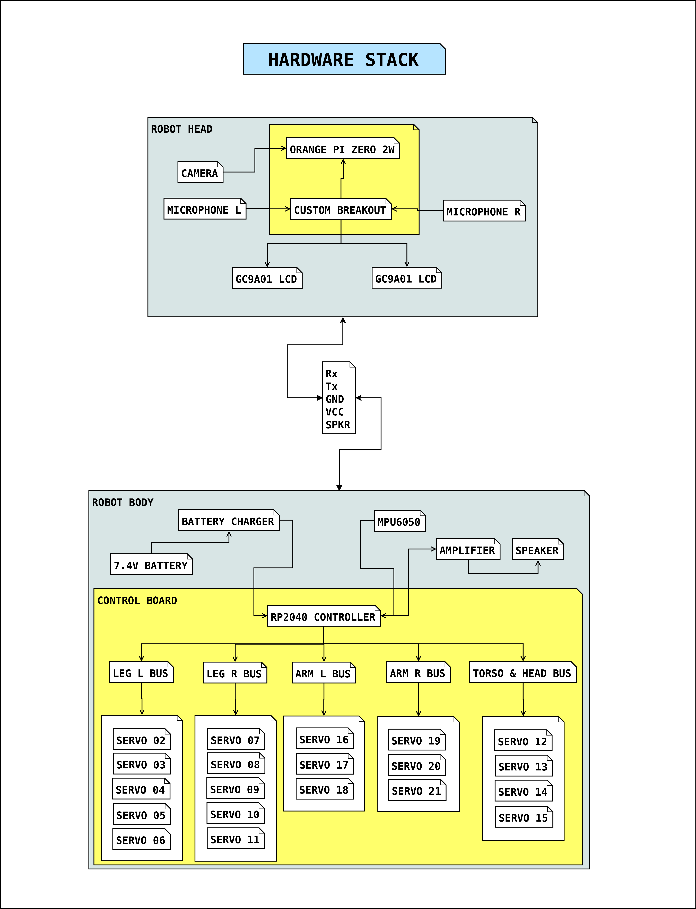

# Robi Mindware (PENDING UPDATES)

Robot control software and board driver for a custom version of the Deagnostini Robi Robot: 
https://www.japantrendshop.com/robi-robot-preassembled-version-p-1622.html

They can also be found for less than $250 on second hand on sites like Mecari japan through Neokyo, along with many other robots: 
https://neokyo.com/en/search/mercari?keyword=robi%20robot&provider=mercari&spid=

This mod and software aims to upgrade generation 1 Robis to support modern software and capabilities and extend the useful life of the robot by allowing anyone who wants cheaper and 
more open avenues into robotics to create a more NAO like robot with cheaper hardware.

This project has kicked off after a period of learning all I could about these robots and similar robots from japan,
since enrolling in a computer science degree, this project and robot will serve as an additional learning aid where I can implement 
what I have learned to create a complete robotics project.

In addition to new software, this mod adds a range of new sensors, custom control boards and lively LCD eyes.
I will eventually make the new driver board compatible with a range of servo brands to allow building from scratch
with more available robotics servos. By working with the restraint of such a small robot, I can focus on smaller components
and create a board that can be used in a larger viariety of diy bots.


Powering up and verifying the new custom breakout, a 3rd revision will be created to address a few issues with the current implementation. The eyes currently run on a C bit banged driver due to SPI and overlay issues on the Orangepi and python bit banging is far too slow, This will be addressed by splitting all signals and using my modified devicetree and overlays.


 
Some Robi parts have been scanned and modified to allow fitting of new hardware with minimal to no damage of the original parts.

The main software is written in python, it sends ID and position commands to a C++ driver on the ESP32 C3 mini.
The ESP32 then processes commands and sends them to the servo bus, daisy chaining is working.

NOTE: The ESP32 will be swapped with a custom RP2040 board.

### Example Command:
```
ID:ANGLE
12:130
15:30
```



I am yet to implement the additional serial ports, ideally I would like to work with 5, however that is unlikely. S0 the alternative 
will be to use 2 or 3 ports and alternate the less critical ones. That way parts of the robot dont have communications interupted as this could be bad, ie: the legs.
NOTE: Development on a RP2350B based microcontroller board is under development and is waiting for some additional validation before I order the boards to be made.

## Hardware:
- Robi servo test board (I will link to an alternative that emulates the same functions in future. It is for setting the ID and testing the motor)
- ESP32 C3 Mini NOTE: FOR INITIAL DEVELOPMENT
- 3.3v-5v Bi-directional logic converter (C3 mini outputs 3.3v logic while the servo requires 5v logic, bi-directional opens up the possibility of adding servo feedback)
- 5v Power supply
- OrangePi Zero 2w or Raspi Zero 2w (More ram the better, Recommended minimum is 4GB)
- REMAINING PARTS TBC




### Picking The Robot:
- Robi 1 or 2 
When selecting a Robi, pick a damaged one or a hand assembled one. There is no point in ruining a good unit when you will need to dissasemble it anyway.
Many Robis have dirty contacts, dry servos, damaged or loose servo cables and maybe sometimes a servo that "Forgot" its settings.
By picking a Robi needing some TLC, you will learn far more and not feel guilt for possibly destroying a functional unit.

## Libraries:
- Panda3D
- Numpy
- OpenCV
- Matplotlib
- Tkinter
- Pandas

## Acknowledgments
The following blog from Japan has proven invaluable, The person behind it deserves lots of credit as they have learned a lot of the harder lessons.
Give them a visit and a thanks if you find it useful.

The site is in Japanese so use google translate if needed. They also have a youtube channel.
- https://www.mcc.mbsrv.net/robox/index.html
- https://www.youtube.com/@craftoyaji


## Additional Useful Sites

I will continue to add more

https://win.adrirobot.it/menu_new/index/index_robi.htm

https://it.emcelettronica.com/levaluation-kit-xmc-2go-di-infineon-come-scheda-sensori-i-robot-robi
